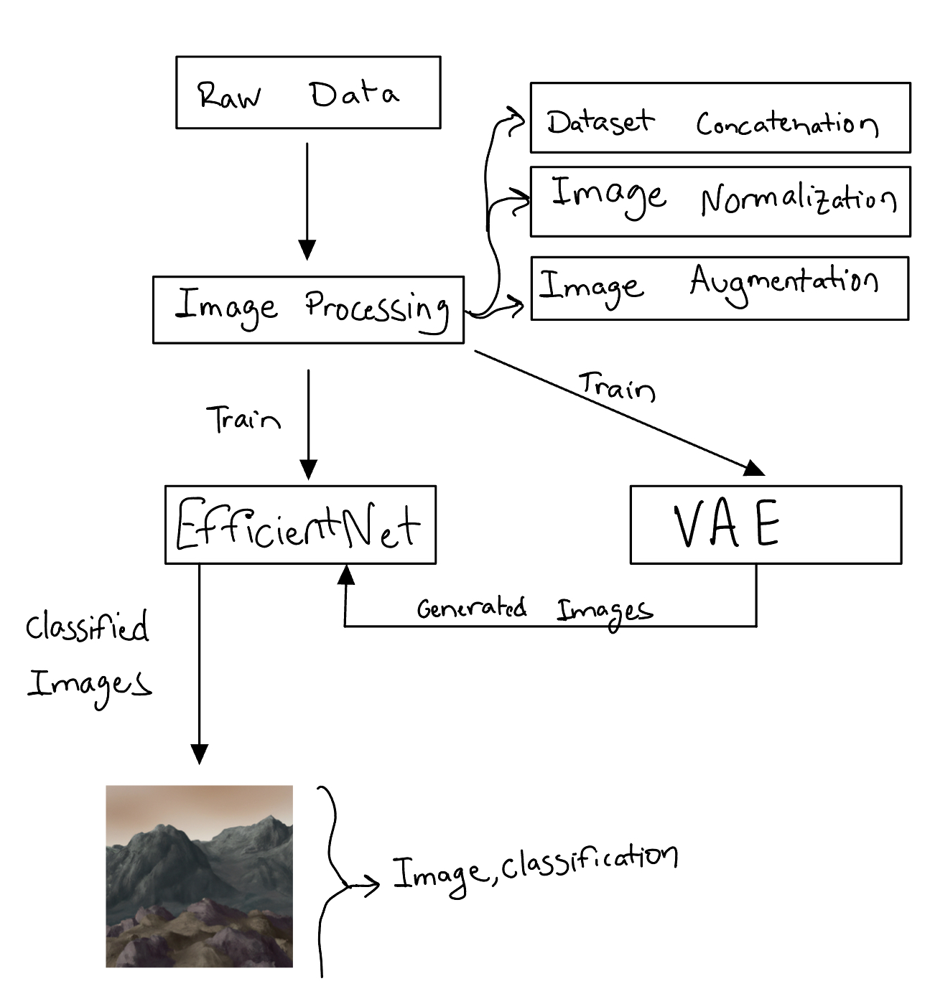
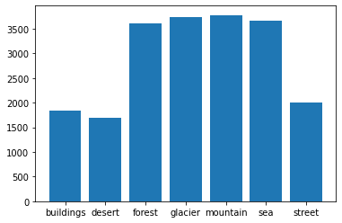
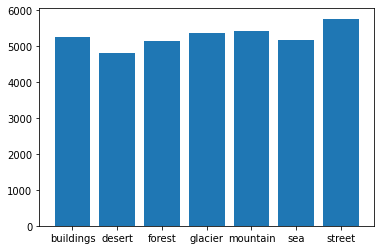
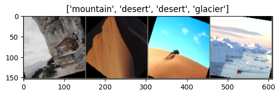
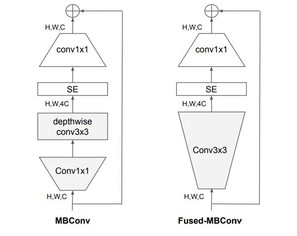
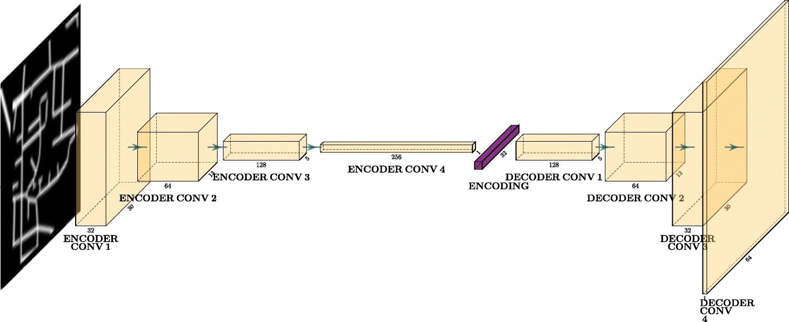
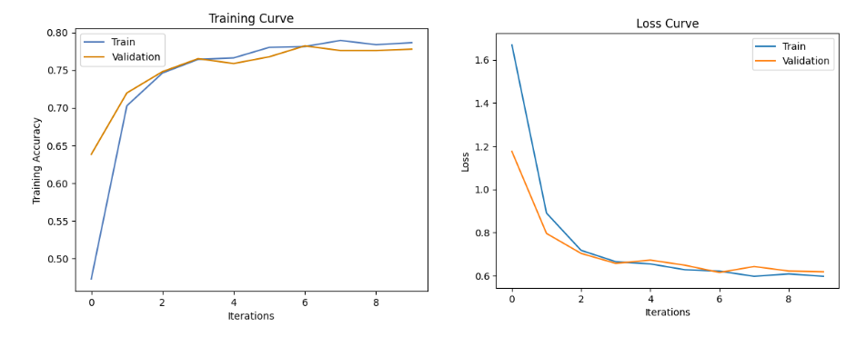
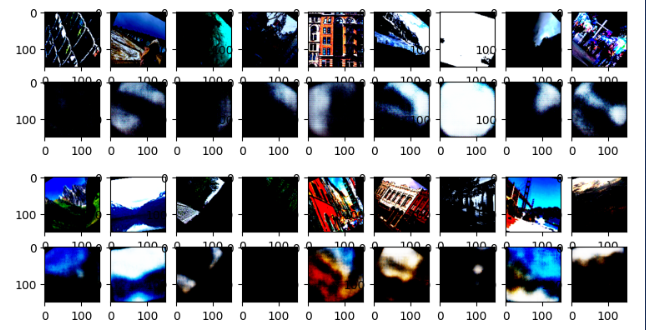
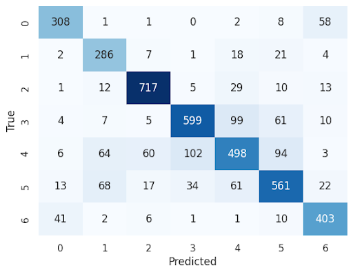

# TerraSculpt: ML-Driven Landscape Synthesis and Classification

Beyond the visual charm of diverse landscapes exists the crucial task of terrain classification, an unsung yet impactful facet of our relationship with the environment. By employing PyTorch-based deep learning to generate and categorize artificial landscapes, this preliminary project looks to uncover a novel layer to environmental monitoring and land-use planning, offering a pragmatic tool for comprehending our dynamic world.

## Table of Contents

- [Overview](#overview)
- [Data Processing](#data-processing)
  - [Data-Augmentation](#data-augmentation)
- [Model Architecture](#model-architecture)
  - [EfficientNetV2](#efficientnetv2)
  - [Variational AutoEncoder](#varational-autoencoder)
- [Training and Testing](#training-and-testing)
- [Results](#results)
- [Discussion](#discussion)

## Overview

The goal of this project is to develop a machine learning pipeline centralized on two sets of deep learning models to begin a preliminary investigation into landscape generation and classification. The aim is to have the models classify landscapes from artificial image data into several categories such as forests, mountains, oceans, and deserts.

Specifically, TerraSculpt will use PyTorch to utilize the power of the EfficientNetV2 Architecture that has been customized with the ability to learn complex patterns and features from a wide range of RGB landscape images. This robust feature extraction and learning ability has enabled the model to accurately classify even blurry and low-quality images generated by the Variational Autoencoder (VAE), as it focuses on key distinguishing characteristics rather than image clarity.

**Tech and Packages**

- Python Version: 3.10
- PyTorch (torchvision)
- Kaggle
- Seaborn and Matplotlib
- CUDA

**Methods Used**

- GPU Training
- Autoencoders
- Convolutational Neural Networks
- Data Augementation
- Google Colab and Visual Studio Code

## Data Processing

I opted for multiple data sources in this project to help ensure the final model isn't biased to a single dataset as well as provider a greater number of images. This leads to a more realistic model by providing a greater variation in training and validation data. I obtained my data by concatenating 2 datasets from Kaggle with overlapping labels

1. [Intel Image Classification](https://www.kaggle.com/datasets/puneet6060/intel-image-classification)

   - ~24,000 RGB images (150x150 pixels)
   - 6 labels: buildings, forests, glaciers, mountains, sea, and streets

2. [Landscape Recognition](https://www.kaggle.com/datasets/utkarshsaxenadn/landscape-recognition-image-dataset-12k-images)
   - ~12,000 RGB images (224x224 pixels)
   - 5 labels: coast, forest, desert, glacier, mountain.

Overlapping classes from the 2nd dataset are added to the 1st; 'Coast' images are included in the 'Sea' class, resulting in **7 total classes** for the combined dataset.

### Data Augmentation

Data Augmentation was needed for a couple of reasons. Exploratory Data Analysis (EDA) revealed a clear class imbalance in the training dataset, with some classes containing up to 3780 images and others with only 1831. This imbalance was mitigated using a random weighted sampler for the underrepresented classes:

  
   

Additionally, augmentation enhanced the classification performance by reducing overfitting and promoting better generalization. It helped the model become more robust, as it learned to recognize objects in varied orientations, positions, scales, and lighting conditions. The following transformations were applied:

- **Resize:** All images are resized to dimensions of 150x150 pixels.
- **Random Crop:** Images are randomly cropped to a size of 125x125 pixels.
- **Random Rotation:** Each image undergoes a random rotation of up to 45 degrees.
- **Random Horizontal Flip:** With a probability of 0.5, images are randomly flipped horizontally.
- **Random Vertical Flip:** With a probability of 0.05, images are randomly flipped vertically.
- **Random Resized Crop:** Random crops of the original image are taken and resized back to 150x150 pixels. The area for cropping is selected from a range of 80% to 100% of the original image.
- **Color Jitter:** Brightness of the images is randomly adjusted with a factor of 0.4.
- **Normalization:** Image tensors are normalized using `mean=[0.485, 0.456, 0.406]` and `std=[0.229, 0.224, 0.225]`.

This results in something like this:

  

## Model Architecture

The classification models will be based on CNN's while the generative models will be based on Autoencoders. To provide baseline results a simple CNN and Convolutional Autoencoder were used. To view the architecture specifics including parameters, output sizes, and distinct layers please refer to the notebook within the google colab folder of this repo where you will find summaries provided by torchinfo

### EfficientNetV2

The primary classifier will be the EfficientNetV2-Large model, an advanced CNN developed by Google AI Research. It is uniquely designed to optimize efficiency and performance through effective scaling methods. It scales the depth (number of layers), width (number of channels), and resolution (size of input images) of the CNN in a balanced manner to avoid overfitting and to ensure effective learning. The model processes images with a resolution of 480x480 pixels and its architecture includes a stem layer, a series of Mobile Inverted Bottleneck Convolution (MBConv) blocks, and a head section with convolutional layer, batch normalization, global average pooling, and a fully connected layer.

Utilizing the principle of transfer learning, I direct the output from the pretrained EfficientNetV2-L model to a custom Artificial Neural Network (ANN). Specifically, I use the pretrained weights of the EfficientNet while freezing the actual model so that only the custom ANN is updated during backpropogation with Cross Entropy as the Loss function. This approach leverages the pretrained model's learned features for the specific task improving the model's performance and reducing the need for extensive training.

  
   

### Varational Autoencoder

The primary generator will be a custom Convolutional Autoencoder (C-VAE). Structured in three parts: an encoder, reparameterization step, and a decoder. The encoder uses 3 convolutional layers with ReLU activation to process input images, after which it computes the mean and standard deviation of the latent space representation. Then, a latent vector is sampled using these calculations, with random noise added for diverse sample generation. The decoder reconstructs the input image from this vector, utilizing 3 transposed convolutional layers. The loss function of this C-VAE uses Mean Squared Error (MSE) for reconstruction loss, and Kullback-Leibler (KBL) divergence to compare the learned latent distribution with a prior one, like a standard Gaussian.

  

## Training and Testing

Due to the large dataset of RGB images all models were training on GPU's using CUDA wherever possible. The dataset was split 70-15-15 into training, validation, and testing respectively. Extensive hyperparameter tuning was conducting while training such different optimizers (Adam, SGD), batch size, learning rate, and more.

Testing was done by obtaining a tensor representation of a decoded image outputed by the VAE. This image was then fed into the EfficientNet and tested for correct classification.

## Results

The baseline classification model, with 7 distinct image classes, achieved a training accuracy of 72%, validation accuracy of 69%, and test accuracy of 69%. There were signs of overfitting as the training curve had an increasing trend, while the validation curve started to flatten.

The primary classification model, EfficientNetV2-L, demonstrated improved performance with a training accuracy of 78%, validation accuracy of 78%, and test accuracy of 77%. This model displayed no signs of overfitting and reached the minima of the loss function quickly, in only 6 epochs:

  

In terms of the generative models, the final losses for the baseline and primary models were 0.892 and 97628, respectively. Yet, comparing these losses isn't straightforward due to the differing characteristics of the models.

The baseline generative model, a convolutional autoencoder, was able to produce relatively clear landscape images:

  

On the other hand, the primary generative model, a convolutional variational autoencoder, managed to capture general spatial features and coloring, but the resulting images were blurry:

  

When evaluated on new, unseen data, the primary classification model maintained strong performance with a test accuracy of 77%. It also successfully classified an image sourced from Google, which shows its robustness against completely new data. Lastly, it was capable of accurately classifying images generated by the variational autoencoder, indicating that, despite their blurriness, these images conveyed sufficient spatial and color features.

  

## Discussion

The image classification models developed performed well, with a test accuracy showing an 8% increase from the baseline model. However, difficulties were encountered with image generation. I initially intended, to use a Deep Convolutional Generative Adversarial Network but due to time and the infamous issues with training GANs, a switch to a Convolutional VAE was necessitated. Despite this, the VAE was able to capture spatial features and colors, indicating potential for improved performance with more training and tuning.

TerraSculpt showcased the potential of combining two distinct deep learning models into a single system, hinting at possibilities for overall performance improvements in machine learning applications. Future work could concentrate on harnessing the strengths of the EfficientNet into a more viable generative model such as a Vision Transformer or various GAN architectures such as a StyleGAN.

As a disclaimer, the dataset used was sourced publicly, presenting no privacy or security concerns. However, ethical issues might arise if the model is used to create fake landscapes, and new data might bring about ethical considerations related to cultural and political motivations based on image locations.

To reflect, TerraSculpt was my first exposure to deep learning and computer vision. It was complex, integrating various models including CNNs, GANs, and autoencoders, beyond a standard machine learning course's scope. The result was a successful creation of a system capable of producing and classifying images using multiple deep learning models, an achievement I am proud of.
